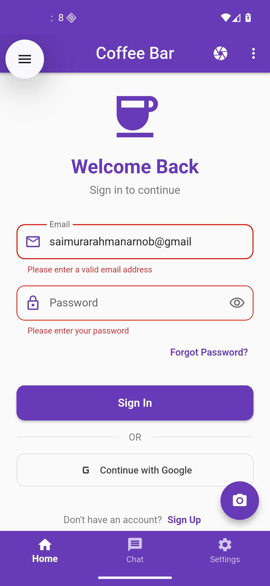

# Flutter Login Page App

A simple Flutter application demonstrating a login page with bottom navigation bar, app bar, and drawer. Built for practice and learning purposes.

## Features

-   📱 **Login Page** - Clean and modern login form with email and password validation
-   🧭 **Bottom Navigation Bar** - Multi-tab navigation system
-   📊 **App Bar** - Custom app bar with menu functionality
-   🎨 **Drawer Menu** - Side navigation drawer with user profile section
-   ✅ **Form Validation** - Email regex validation and password field with show/hide toggle
-   🎨 **Material Design** - Uses Material 2 with custom theme (Deep Purple)

## Components

### Login Form

-   Email field with strict validation (lowercase only, prevents consecutive dots)
-   Password field with visibility toggle
-   Auto-validation after first submission
-   Custom input decoration with rounded borders and shadows

### Navigation

-   Bottom navigation bar for switching between different screens
-   Drawer menu with user profile display
-   Custom app bar with menu icon

## Validation Rules

**Email validation:**

-   Must start with a lowercase letter
-   Allows letters (a-z), numbers (0-9), hyphens (-), underscores (\_), and dots (.)
-   No consecutive dots allowed
-   Must have valid domain and TLD (e.g., @gmail.com)
-   Lowercase only

## Getting Started

1. Clone this repository
2. Run `flutter pub get` to install dependencies
3. Run `flutter run` to start the app

## Purpose

This project is created for **practice and learning purposes** to understand:

-   Flutter form validation
-   State management with StatefulWidget
-   Navigation patterns (BottomNavigationBar + Drawer)
-   Custom theming and styling
-   Input decoration and user experience

## Screenshots

  
  

  <em>Login Page</em> &nbsp;&nbsp;&nbsp;&nbsp;&nbsp;&nbsp;&nbsp;&nbsp;&nbsp;&nbsp;&nbsp;&nbsp;&nbsp;&nbsp;&nbsp;&nbsp;&nbsp;&nbsp;&nbsp;&nbsp;&nbsp;&nbsp;&nbsp;&nbsp;&nbsp;&nbsp;&nbsp;&nbsp;&nbsp;&nbsp; <em>Form Validation</em>

---

**Note:** This is a practice project and is not intended for production use.
